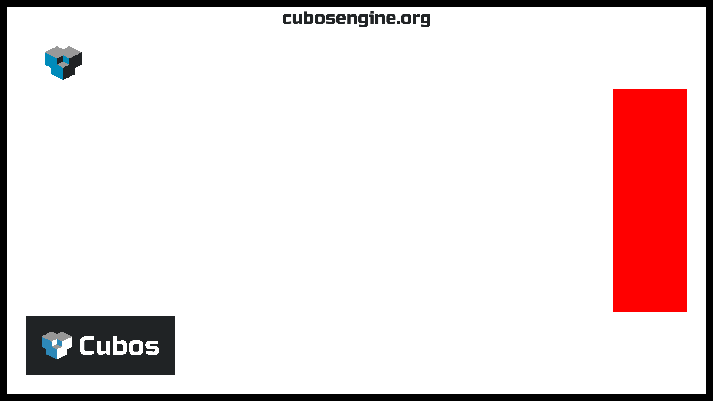

0.5 is out!
###########

:date: 2024-12-02 00:00:00
:category: Release
:summary: Cubos 0.5 Release!

.. role:: dim
    :class: m-text m-dim

New 0.5 Features
================

This blog post covers the most important changes, but you can check out the full changelog in our `repository <https://github.com/GameDevTecnico/cubos/blob/main/CHANGELOG.md>`_.

On the Editor
-------------

Hold mode for Debug Camera. :dim:`(@jdbaracho)`
~~~~~~~~~~~~~~~~~~~~~~~~~~~~~~~~~~~~~~~~~~~~~~~

It wasn't very convenient to have only a toogle to control the Debug Camera, so we added a hold mode.

Editor Feature 1 :dim:`(@Author1)`
~~~~~~~~~~~~~~~~~~~~~~~~~~~~~~~~~~

TODO: explain feature and why it is useful

On the Engine
-------------

Point Light Shadows :dim:`(@tomas7770)`
~~~~~~~~~~~~~~~~~~~~~~~~~~~~~~~~~~~~~~~

Over the past couple of releases, **shadows** have been gradually introduced to the engine's graphics
renderer, starting with spotlight shadows, and then directional ones. Naturally, the next step was to
implement shadows for point lights, finally completing support for the most common types of lights.

Point shadows are enabled by adding a `PointShadowCaster <https://docs.cubosengine.org/structcubos_1_1engine_1_1PointShadowCaster.html>`_
component to the light entity.
They behave similarly to spot shadows, lacking all the configurable values of the more complex directional shadows.
You can read the previous blog posts for more detailed information (`0.3 <https://cubosengine.org/03-is-here.html>`_, `0.4 <https://cubosengine.org/04-is-out.html>`_).

In terms of implementation, point shadows are also very similar to spot shadows, using a shared atlas texture
that stores shadow maps for every point light in a quadtree structure. However, because point lights cast light in
all directions, there are 6 atlas textures, one for each direction of a cube.

The final result of our shadows engine can be seen in the `Shadows sample <https://github.com/GameDevTecnico/cubos/tree/main/engine/samples/render/shadows>`_.
Below is a screenshot of the sample with all light types casting shadows. Some tweaks have been done to better highlight the shadows.

.. image:: images/0.5/shadows_sample.png

Audio Support through the Audio Plugin  :dim:`(@Dageus, @diogomsmiranda)`
~~~~~~~~~~~~~~~~~~~~~~~~~~~~~~~~~~~~~~~~~~~~~~~~~~~~~~~~~~~~~~~~~~~~~~~~~

This release is a significant milestone for the CUBOS engine, as it finally introduces Audio functionality!

The new ``audioPlugin`` leverages the previously implemented ``Audio Context`` to manage audio playback. It introduces two new components:

- **``AudioSource``**: Attach this component to entities to play audio files in supported formats such as FLAC, MP3 and WAV.
- **``AudioListener``**: Attach this component to an entity to capture audio from the scene.

With the plugin, you can now register listeners, and control audio sources with play, pause, and stop functionality. You can also customize audio playback by modifying the ``AudioSource`` properties for each entity. Adjust settings such as volume, pitch, and looping behavior to tailor the sound to your needs.
Due to restrictions in our audio backend, you can only have up to **three active listeners** at a time. For practical examples of how to use these new audio components (``AudioPlay``, ``AudioPause``, ``AudioStop``), check out our `Audio Sample <https://github.com/GameDevTecnico/cubos/blob/main/engine/samples/audio/main.cpp>`_.

Sub-title for this feature
**************************

TODO: more explaining

Method to save settings to files :dim:`(@SrGesus)`
~~~~~~~~~~~~~~~~~~~~~~~~~~~~~~~~~~~~~~~~~~~~~~~~~~

Some way to interact with the files of the ``Settings`` resource was missing,
there was only a startupSystem that would load the file from a command line
argument and then no way for changes to persist which was a bit inconvenient.

So now there are two simple new methods - ``save(path, indentation)`` and
``load(path)`` - to save and load the ``Settings`` to and from
``cubos::core::data::FileSystem`` paths. E.g:

.. code-block:: cpp

     {
            settings.merge(settings::load("/file.json"))
            settings.save("/file_backup.json");
        }

Collision detection between VoxelCollisionShapes :dim:`(@joaomanita)`
~~~~~~~~~~~~~~~~~~~~~~~~~~~~~~~~~~~~~~~~~~~~~~~~~~~~~~~~~~~~~~~~~~~~~

The engine was only able to able to detect collisons between boxes, now we can add a `VoxelCollisionShape <https://docs.cubosengine.org/classcubos_1_1engine_1_1VoxelCollisionShape.html>`_
to decompose a voxel shape into multiple box collision shapes.

Anti-aliasing using FXAA technique :dim:`(@kuukitenshi)`
~~~~~~~~~~~~~~~~~~~~~~~~~~~~~~~~~~~~~~~~~~~~~~~~~~~~~~~~~~~~~~~~~~~~~
We introduced the FXAA (Fast Approximate Anti-Aliasing) technique to reduce jagged edges in the rendered images. 
As you can see in the images below, the FXAA smooths out the visuals without the performance cost of traditional anti-aliasing methods.

.. image-comparison::
    :after: {static}/images/0.5/cars_after.png
    :before: {static}/images/0.5/cars_before.png

UI text element using MSDF for text rendering :dim:`(@mkuritsu)`
~~~~~~~~~~~~~~~~~~~~~~~~~~~~~~~~~~~~~~~~~~~~~~~~~~~~~~~~~~~~~~~~

Another great addition to the CUBOS engine was the support for text rendering in the UI, this will greatly improve the capabilities 
for communicating with the player in future games developed with the engine.

This new features includes and `uiTextPlugin` that can be added wich contains the `UIText` component, this one contains all the data needed
to draw text on the screen. The plugin also adds two new asset types:

- **Font**: represents a font to be that can be used to create font atlases (.ttf and .otf supported).
- **FontAtlas**: atlas created from a given font with different configurable properties. 

In order to draw the text on the screen this plugins uses Multi Signed Distante Fields (MSDFs) with the help from `msdfgen <https://github.com/Chlumsky/msdfgen>`_ 
and `msdf-atlas-gen <https://github.com/Chlumsky/msdf-atlas-gen>`_, and `FreeType <https://freetype.org/>`_ to load different font formats. Below is a screenshot
taken from the UI sample available in the engine showcasing the text rendering in action.

**Note:** Currently only the ASCII charset is supported, UTF-8 support will be worked on in a future release.

Enable assets to be identified in the code by their file path :dim:`(@GalaxyCrush)`
~~~~~~~~~~~~~~~~~~~~~~~~~~~~~~~~~~~~~~~~~~~~~~~~~~~~~~~~~~~~~~~~~~~~~~~~~~~~~~~~~~~

Assets could only be identified by their UUID, which can be hard to keep track of for human developers.
Now, they are able to be identified by their path, thus making them easier to handle when developing projects with CUBOS.
E.g., you can now do:

.. code-block:: cpp

    Asset<Scene> SceneAsset = AnyAsset("/path/to/asset");

instead of:

.. code-block:: cpp

    Asset<Scene> SceneAsset = AnyAsset("uuid");

Option to use Shadow Normal Offset Bias algorithm :dim:`(@GalaxyCrush)`
~~~~~~~~~~~~~~~~~~~~~~~~~~~~~~~~~~~~~~~~~~~~~~~~~~~~~~~~~~~~~~~~~~~~~~~

We noticed that the shadows had some `shadow acne <https://digitalrune.github.io/DigitalRune-Documentation/html/3f4d959e-9c98-4a97-8d85-7a73c26145d7.htm#Acne>`_ and/or `peter panning <https://digitalrune.github.io/DigitalRune-Documentation/html/3f4d959e-9c98-4a97-8d85-7a73c26145d7.htm#PeterPanning>`_ artifacts in some samples. So, to improve it, we implemented the option of using the Shadow Normal Offset Bias algorithm, which improved the quality of the shadows and reduced these artifacts. To use the algorithm, the user simply has to assign a value to the normalOffsetScale field in the light casters `ShadowCaster  <https://docs.cubosengine.org/structcubos_1_1engine_1_1ShadowCaster.html>`_.

Resource to easily configure constants in the physics solver :dim:`(@GCeSilva)`
~~~~~~~~~~~~~~~~~~~~~~~~~~~~~~~~~~~~~~~~~~~~~~~~~~~~~~~~~~~~~~~~~~~~~~~~~~~~~~~

The physics solver had some constants that were hardcoded, which made it difficult to change them. Now we have a resource that allows the user to easily configure these constants.

Contact caching for collision between box shapes :dim:`(@fallenatlas)`
~~~~~~~~~~~~~~~~~~~~~~~~~~~~~~~~~~~~~~~~~~~~~~~~~~~~~~~~~~~~~~~~~~~~~~~

We added contact caching as a first step towards implementing warm-starting. Contact caching consists of keeping information about collisions that were happening in the previous physics update
so that in the next update we can trace them back. This information consists of identifiers for each collision manifold and the corrections applied to each contact point. Due to limitations in the current implementation of 
collisions between entities, this is currently only supported for box shapes.

On the Core
-----------

A Proper CMake Configuration :dim:`(@RiscadoA)`
~~~~~~~~~~~~~~~~~~~~~~~~~~~~~~~~~~~~~~~~~~~~~~~

Previously, our `CMake <https://cmake.org/>`_ build configuration, while functional, was really incomplete in terms of features and was also extremely messy.
With the engine becoming more and more fleshed out, we started wanting to be able to install the engine as a library system-wide, so that we could use it in other projects
Before, we always simply added the engine repository as a ``git`` submodule in our projects, but this meant having one copy locally of the whole codebase for each project, which was not ideal.
So, we decided to clean up the CMake configuration, and add installation and ``find_package`` support. In pratice, this means that you can now install the whole Cubos project, and to use it in another project, you just need to add the following lines to your ``CMakeLists.txt``:

.. code-block:: cmake

    find_package(cubos REQUIRED)
    target_link_libraries(your_game PRIVATE cubos::engine)

One big advantage of this is that we can now also install Quadrados and Tesseratos, the tools we use for making games with Cubos, system-wide, as you would with any other application.
As of now, Cubos has only been packaged for NixOS, but we haven't contributed it to the Nixpkgs repository yet. We plan to do so in the future, and also to package it for other distributions.

Web Support with Emscripten :dim:`(@RiscadoA, @luishfonseca)`
~~~~~~~~~~~~~~~~~~~~~~~~~~~~~~~~~~~~~~~~~~~~~~~~~~~~~~~~~~~~~

We've had a PR open since 0.2 for porting Cubos to the web with `Emscripten <https://emscripten.org/>`_, but it was constantly postponed due to some issues still being present, and the fact that we were focusing on other features.
Now, we finally made the final push to get it working, and now Cubos can be compiled to WebAssembly and run in the browser!

We think this is an important feature, as for game jams, for example, it's very useful to be able to share your game with others without them having to download anything, and also to be able to play it on any device.
We also think it's a good way to showcase the engine to people who might be interested in using it, but don't want to download it.
We plan on embedding each sample on their respective documentation page, but that will be left for a future release.

One of the major challenges was guaranteeing compatibility with WebGL2. Fortunately, the whole rendering code is built on top of a rendering API abstraction layer.
We had to make some changes to this layer to guarantee we cover strictly the intersection between the features of OpenGL 3.3 and WebGL2, but we managed to do it without much hassle.
As of now, this means we're making some performance sacrifices, as we're not using advanced features even when they're available. We plan to address this in the future.

Next Steps
==========

In the next release, which should be out by **TODO WHEN**, we're planning to work on the following features:

* Toggleable gravity on the physics plugin.
* Warm starting in physics solver.
* Graphics performance improvements.
* Transparent voxel rendering.
* Particle system.
* Editor UX improvements, making it very useful.
* New scene editor.

And many other features coming up in the future.

We also developed a demo showcasing the new features of this release, which you will be able to check out pretty soon here.

You can check out the full list of stuff we want to get done in the `milestone <https://github.com/GameDevTecnico/cubos/milestone/29>`_ for the next release.
