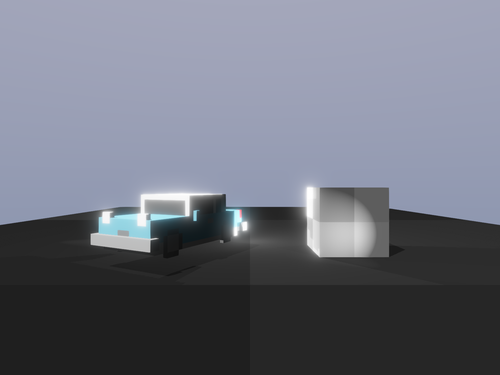

0.5 is out!
###########

:date: 2024-12-02 00:00:00
:status: hidden
:category: Release
:summary: Cubos 0.5 Release!

.. role:: dim
    :class: m-text m-dim

New 0.5 Features
================

This blog post covers the most important changes, but you can check out the full changelog in our `repository <https://github.com/GameDevTecnico/cubos/blob/main/CHANGELOG.md>`_.

On the Editor
-------------

Hold mode for Debug Camera. :dim:`(@jdbaracho)`
~~~~~~~~~~~~~~~~~~~~~~~~~~~~~~~~~~

It wasn't very convenient to have only a toogle to control the Debug Camera, so we added a hold mode.

Editor Feature 1 :dim:`(@Author1)`
~~~~~~~~~~~~~~~~~~~~~~~~~~~~~~~~~~

TODO: explain feature and why it is useful

On the Engine
-------------

Point Light Shadows :dim:`(@tomas7770)`
~~~~~~~~~~~~~~~~~~~~~~~~~~~~~~~~~~

Over the past couple releases, **shadows** have been gradually introduced to the engine's graphics
renderer, starting with spot light shadows, and then directional ones. Naturally, the next step was to
implement shadows for point lights, finally completing support for all types of lights.

Once again, point shadows are enabled by adding a component to the light entity, this time a
`PointShadowCaster <https://docs.cubosengine.org/structcubos_1_1engine_1_1PointShadowCaster.html>`_.
They behave similarly to spot shadows, lacking all the configurable values of the more complex directional shadows.
You may want to read the previous blog posts for more detailed information on this.

In terms of implementation, point shadows are also very similar to spot shadows, using a shared atlas texture
that stores shadow maps for every point light in a quadtree structure. However, because point lights cast light in
all directions, there are actually 6 atlas textures, one for each direction of a cube.

The final result of shadows can be seen in the `Shadows sample <https://github.com/GameDevTecnico/cubos/tree/main/engine/samples/render/shadows>`_.
Below is a screenshot of the sample with all light types casting shadows. Some tweaks have been done to better highlight the shadows.

Sub-title for this feature
**************************

TODO: more explaining

On the Core
-----------

Core Feature 1 :dim:`(@Author3)`
~~~~~~~~~~~~~~~~~~~~~~~~~~~~~~~~

TODO: explain feature and why it is useful

Next Steps
==========

In the next release, which should be out by **TODO WHEN**, we're planning to work on the following features:

* Very cool feature 1.
* Very cool feature 2.
* ...

TODO: maybe some more stuff here if needed

You can check out the full list of stuff we want to get done in the `milestone <https://github.com/GameDevTecnico/cubos/milestone/29>`_ for the next release.
